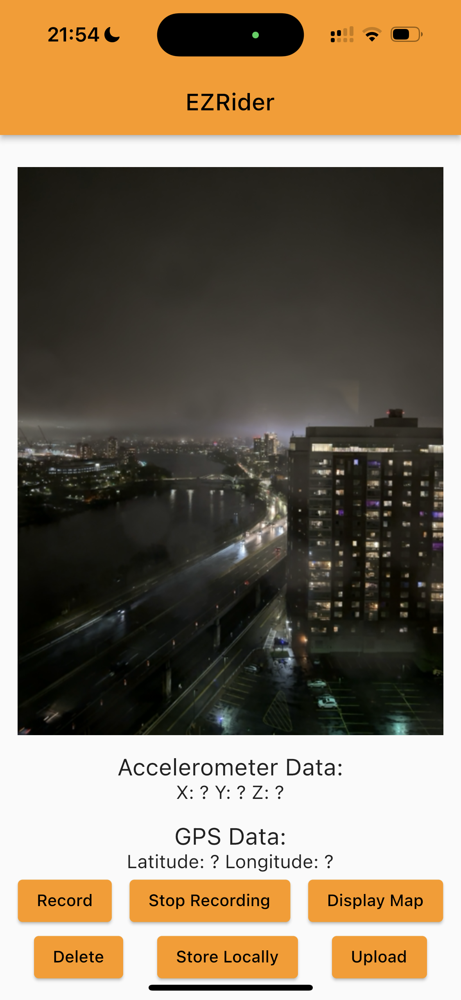
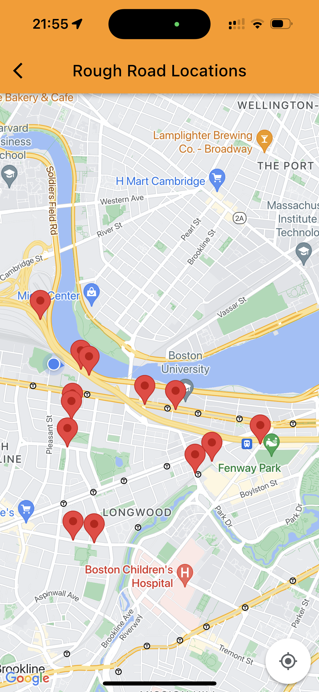

# EZRider

EZRider is a road roughness mapping system developed that allows users to collect different data modalities for a pothole location and road roughness machine learning task. The system aims to help users and transportation agencies identify road quality issues and improve road maintenance. The application is developed using the Flutter framework and the collected data is stored on Google Firebase. The Inception V3 deep neural network and the Z Peak algorithm are leveraged to predict the locations of rough roads using the collected data. 

## Data Collection

The app collects the following information:

- Images: EZRider captures images of the roads the user is driving on.

- Accelerometer data: EZRider records 3-dimensional accelerometer data, which provides information on the roughness of the road.

- GPS location: The app records the user's latitude and longitude using the phone's GPS. 

Here is a JSON object showing a sample data point:

```
{"2023-03-21T18:24:46.833727":
  {
  "path":"/var/mobile/Containers/Data/Application/862AE1CB-F5D9-46FC-9AEA-DC36D4F4DF21/Documents/camera/pictures/CAP_C6A59ED2-B42D-48A3-B844-8C202C714CBD.jpg.jpg",
  "x":0.18534222394227984,
  "y":0.04553083181381226,
  "z":0.010495567321777345,
  "lat":42.54766260841556,
  "long":-71.37988141788043
  }
}
```

## Models Summary

The collected data is uplaoded to Google Firebase for storage and processing. The Z Peak algorithm is trained on the collected accelerometer data points to predict rough road locations. The Inception V3 binary image classifier is trained on a pothole dataset found online. We conduct model inferencing using the Inception V3 net on the images collected through the application. We have provided a detailed explanation of the models in the READ_Software.md file.


## Installation and Usage

To install EZRider, follow these steps:

1. Contact the owner of this repository to gain access of the app on TestFlight.
2. Install TestFlight on your iPhone from the App Store.
3. Open TestFlight and install the EZRider App.

Once EZRider is installed, you can use it to collect data on road conditions as you drive. The app will capture images, accelerometer data, and GPS location when prompted, which can be used to identify potholes and rough road conditions. The aggregated data will be shown on a map platform supported by the google map API where the detected potholes will be displayed in a orderly fashion.

## Future Developments

In the future, we plan to add several new features and improvements to the EZRider app. Some of these include:

- Improved machine learning algorithms to identify potholes and road roughness with higher accuracy.
- Enhanced data visualization and analysis tools to help researchers and transportation agencies better understand road conditions.
- Improved user interface and user experience to make the app more intuitive and user-friendly.

## Additional Repositories

We have created repositories that contain CNN models trained on open-source datasets for pothole recognition. The repos can be found [here](https://github.com/aymane-eljerari/pothole-localization) and [here](https://github.com/balajisath/Road_Roughness_Mapping_System).

Initially, we chose Expo for its cross-platform compatibility and quick set-up to build our mobile app. However, as none of us had extensive knowledge of JavaScript or Expo, we eventually made the decision to switch to Flutter. The repo for the Expo app can be found [here](https://github.com/hmyi/senior_design_mobile_app).

## Data Privacy and Security

The data privacy and security of our users is of the utmost importance to us. EZRider anonymizes all user data to ensure that there is no connection between the data collected and the user.

## Screenshots




