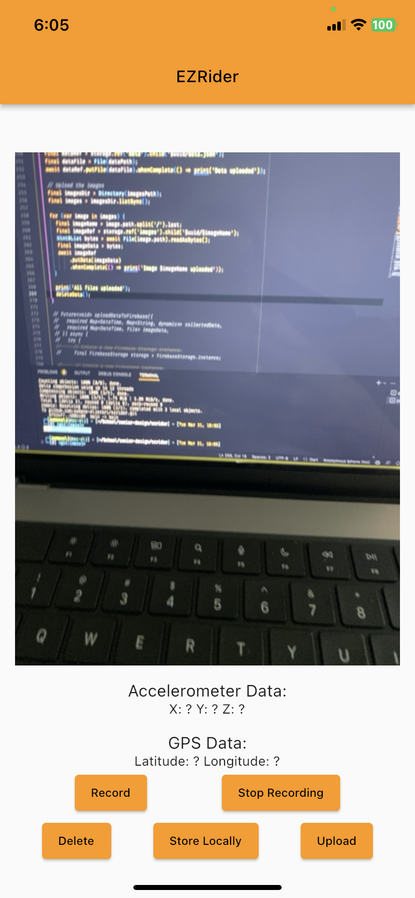

# EzRider

A Flutter mobile app to collect different data modalities for a pothole location and road roughness deep learning task.

# Data
The data we store is completely anonymous. Here is a JSON object showing a sample data point:

```
{"2023-03-21T18:24:46.833727":
  {
  "path":"/var/mobile/Containers/Data/Application/862AE1CB-F5D9-46FC-9AEA-DC36D4F4DF21/Documents/camera/pictures/CAP_C6A59ED2-B42D-48A3-B844-8C202C714CBD.jpg.jpg",
  "x":0.18534222394227984,
  "y":0.04553083181381226,
  "z":0.010495567321777345,
  "lat":42.54766260841556,
  "long":-71.37988141788043
  }
}
```
We store images of the roads you are driving on, 3 dimensional accelerometer data and latitude and longitude using your GPS location. There is no link between the user and the stored data making it completely anonymous. 

## App Screenshots


