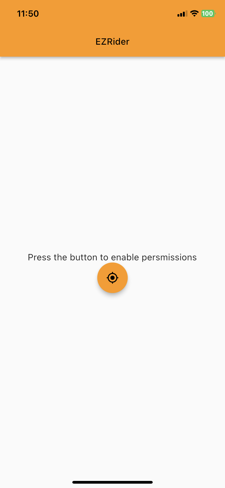
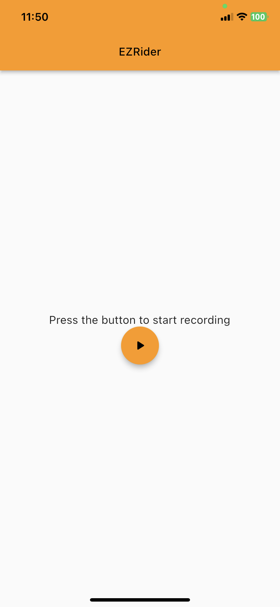
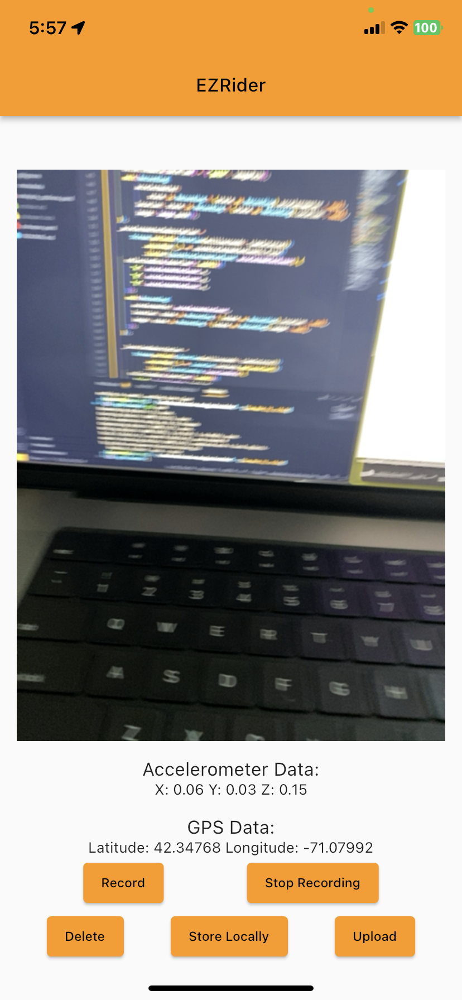

# EzRider

A Flutter mobile app to collect different data modalities for a pothole location and road roughness deep learning task.

## App Screenshots

1. Enable Permissions

1. Begin Recording

1. Stop Recording
