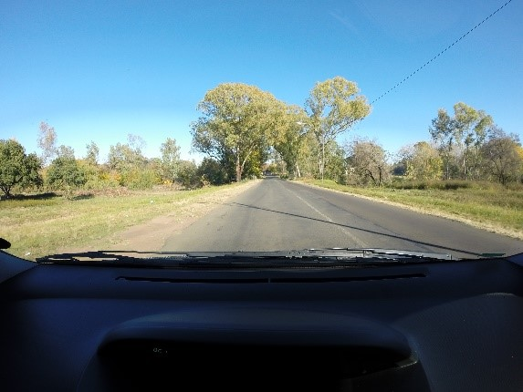

# README_Software

## Technical Background

Our system consists of three main components: the frontend Flutter mobile application, the BaaS software integrated with Google Cloud, and the models (machine learning and statistical) running on the backend. 

## Mobile Application Development

We design the EZRider mobile application following a user centric approach. Our goal was to build a user friendly interface that could allow us to perform two distinct tasks; data collection and analysis. We decided to use the onboard sensors available on all modern smartphones to collect accelerometer, gps and image data. Following this step, we analyze the data collected to reflect the adequate road roughness metric.

In order to appeal to a broader user base, we had to develop the mobile using a cross platform framework. That is why we chose Flutter, an open source framework created by Google that allows us to build a mobile application and deploy it to different smartphone operating systems (Android, iOS) using a single code base. The Flutter application was designed using BLoC to separate the user frontend from the backend business logic needed to operate the application. This approach facilitates the implementation of new features while keeping the code structure organized.

## Cloud Storage

To go along with Flutter, we chose Firebase as our cloud backend to store the collected data. The three data streams we collect are anonymized such that each user data collection session is given an unidentifiable random string of characters. The data is stored using key value pair approach, for each image taken, we store a JSON map containing x, y, z accelerometer data and latitude, longitude gps location. Furthermore, the files stored in firebase can be easily downloaded onto a user's local device using a python script we wrote and subsuquently fed into our ML models.

## Models Summary

The accelerometer data points are used to train a simple mathematical model called the Z peak algorithm with iterative threshold selection. Every element in the JSON file comes with 5 values: accelerometer values in the x, y, and z directions (3) and GPS coordinates (2). This makes it easy to tag a GPS location with an accelerometer data point. The predicted rough road locations are found using the GPS coordinates of the accelerometer data points classified as anomalies by the Z peak model.

The Inception V3 neural network is trained on a pothole dataset found online. Then, we conducted model inferencing (testing after deployment) using the deep learning model on the images collected through the application. It should be noted that the neural network is not trained on the collected image data. 

## Z Peak Algorithm

We collected enough accelerometer data points (around 3000) and images by driving around Boston. The data is stored on Firebase. We created a separate python notebook to implement the model for rough road detections. The collected data was imported from Firebase to Google Drive using a module called Pyrebase. We combined multiple JSON files into one large Pandas dataframe.

We plotted the accelerometer points on a 3D graph, plotted the x-z accelerometer values, and graphed the accelerometer values in the x direction. Since the phone was kept in landscape mode while collecting data, the accelerometer values in the x direction would change the most instead of the values in the z direction. 

We decided to use the Z Peak algorithm to predict rough road locations using accelerometer data points. The threshold value for the Z Peak algorithm was decided using the iterative selection threshold method. The Z Peak algorithm identifies rough road locations by checking if the x direction accelerometer values exceed the threshold value or not. The iterative selection method for finding the threshold is based on identifying peak points (maxima) in the x-axis accelerometer values. The median of the peak points is calculated and set as the initial threshold. The dataset of peak points is split into two sets depending on whether each point exceeds the initial threshold or not. Now, the new threshold is set as the average of the means of the two separate datasets. The process converges when the new threshold and old threshold only differ by a certain amount. The predicted rough road locations are saved as a dataframe and uploaded to Firebase storage as a JSON file. 

The repo implementing this model can be found [here](https://github.com/balajisath/Road_Roughness_Mapping_System).

## Inception V3

The Inception V3 neural network is pre-trained on the ImageNet dataset. We used this model for classifying images as having rough roads (positive) or not (negative).

The following two datasets were used for training. The two sets were concatenated to create a larger dataset. The combined data set contains 10,662 training images, 1184 validation images, and 984 testing images. A few samples from the training set are shown below. Both the datasets were generated by the same person for a paper. The images were collected by mounting a camera on the vehicle’s dashboard. The images in the online dataset resemble the images taken through our application. Hence, the model will be able to generalize well when testing on the images collected through the application. The images (RGB) are rescaled (480x640) using the image_dataset_from_directory function offered by Keras.

1.     https://www.kaggle.com/datasets/felipemuller5/nienaber-potholes-1-simplex
2.     https://www.kaggle.com/datasets/felipemuller5/nienaber-potholes-2-complex

Negative sample from the training set           Positive sample from the training set

We downloaded the dataset from Kaggle to Google Drive through Kaggle's API and a JSON file containing the username and key. We imported the dataset to a Google Colab notebook using the image_dataset_from_directory function offered by Keras. The dataset was split into training, validation, and test sets. The Inception V3 pre-trained model was imported from Keras without including the top layer. We added a set of new layers on top of the imported base model. We trained the net for 10 epochs (after freezing imported base layers and only changing the parameters of the newly added layers) with a large learning rate. Then, we trained the net for 15 epochs (after unfreezing all layers and changing parameters of both the base layers and newly added layers) with a small learning rate. We used the binary cross entropy loss and the sparse categorical cross entropy loss with the Adam optimizer. The neural network gave an accuracy of 91% with the binary cross entropy loss and a test accuracy of 90% with the sparse categorical cross entropy loss. 
 
The Inception V3 neural network gave >75% accuracy when tested on the images collected through our EZRider application.

The repo implementing this model can be found [here](https://github.com/balajisath/Road_Roughness_Mapping_System).

